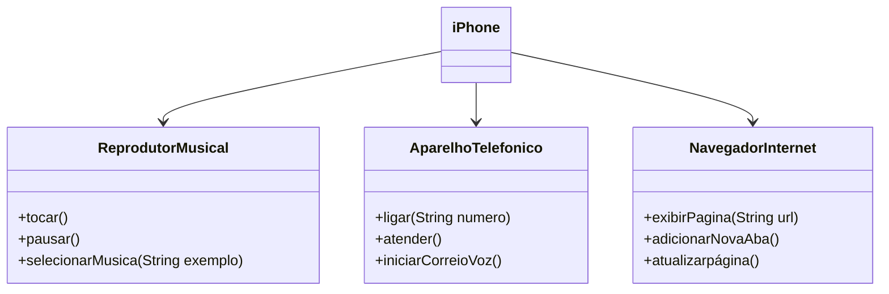

## Modelando o iPhone com UML e implementando funções: Funções de Músicas, Chamadas e Internet

### Funcionalidades a Modelar
* Reprodutor Musical
Métodos: tocar(), pausar(), selecionarMusica(String musica)
Aparelho Telefônico

* Métodos: ligar(String numero), atender(), iniciarCorreioVoz()
Navegador na Internet

* Métodos: exibirPagina(String url), adicionarNovaAba(), atualizarPagina()

### Diagrama UML

